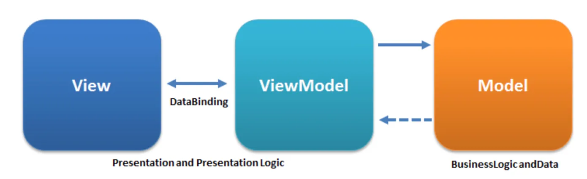
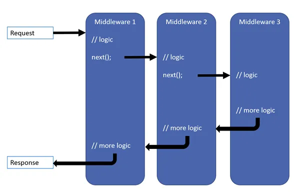

# Architectural Pattern

MVC / MVVM / MVP
\
在 MVC / MVP 中，都需要有 View 的引用來更新 UI。但在 MVVM 中，由View 主動觀察資料，在資料變化後收到通知，而自動更新。 ViewModel 不需要知道 View 是誰。

# MVVM Pattern

Model：
與原先 MVC 中的 M (Model) 是一樣的，用來資料儲存、資料型別定義
只能與 ViewModel 進行溝通，不能與 View/ViewController 直接溝通

ViewModel：
負責將 Model 的資料轉換成 View/ViewController 所需的格式
處理網路請求的部分

View / ViewController：
接收 ViewModel 的資料來做 UI 畫面呈現、與使用者互動
只能與 ViewModel 進行溝通以及 Data Binding
只能透過 ViewModel 來跟 Model 進行間接溝通

# Framwork

.Net / Angular / Vue / React (library)

# .Net Framwork

## WinForm / WPF

Windows Form (WinForm) 是微軟發布的第一代桌面應用程式開發框架，讓程式設計師可以輕鬆托放幾個控制項(Control)、撰寫事件(Event)的回呼(Callback)就可以寫好程式。由於當時的年代沒有甚麼跨平台的觀念，所以自然也不需要切開邏輯層與表現層，因此WinForm應用程式的界面與邏輯都是綁在一起的。

Windows Presentation Foundation (WPF) 是第二代的桌面應用框架，引入標記式語言XAML來表現界面(類似網頁的HTML)。並加入資料綁定(Data Binding)的功能，讓邏輯與介面可以在不同的檔案中定義，再透過資料綁定來參照。
到了近幾年來跨平台的風氣越來越盛，程序員自然也希望桌面應用程式可以擴展到網頁、移動端，同時又希望各個平台之間共用相同的邏輯。因此，就會需要將原先WPF應用中的邏輯與界面完全切割開來，並把邏輯層放到核心(Core)專案，讓所有平台共享Core裡的邏輯。而這就是MVVM架構的來由。

Model View View-Model (MVVM) 是一套架構模式(Architecture Pattern)，不同於設計模式(Design Pattern)，架構模式關注的是程式整體的架構、模組之間的職責分配，而非僅僅為了實現特定功能的設計模式。MVVM中，模型(Model)就是邏輯層，界面(View)就是表現層，ViewModel則是連結View與Model的橋樑。因為WPF提供強大的Data Binding讓ViewModel可以輕鬆的綁定給View，因此MVVM架構非常適合使用在WPF中。透過MVVM，我們可以將Model與ViewModel都放入Core專案，讓WPF專案或是其他平台中的View去綁定ViewModel。Model只需要處理好邏輯與資料，ViewModel只需要從Model中拿到資料，View只需要綁定ViewModel的資料並呈現給用戶。整個程式的功能清楚了劃分後，便可以輕鬆的跨平台。

現在我們對WinForm, WPF, MVVM都有一定的了解後，就可以知道什麼時候需要用到MVVM？首先，WinForm專案是不可能使用MVVM的，畢竟沒辦法切開表現與邏輯，什麼都免談。再來，若只是單純的想要使用WPF開發桌面應用，那麼也是用不到MVVM的，畢竟不需要跨平台，自然就不需要抽出需要共用的邏輯。然而，由於資料綁定這功能大大簡化了傳統WinForm在程式中轉換資料的麻煩，因此即便不需要跨平台，WPF應用也是建議按照MVVM的架構去撰寫，熟練之後事實上開發WPF比WinForm的事件驅動模式要方便得多。

# Middleware

https://medium.com/@atailin.work/%E9%90%B5%E4%BA%BA%E8%B3%BD-asp-net-core-3-day03-middleware-1f726c90f6e8
\
https://learn.microsoft.com/en-us/aspnet/core/fundamentals/middleware/write?view=aspnetcore-8.0

# Microservices

微服務
- 是一種軟體架構風格
- 是一種應用程式開發架構類型。微服務可讓大型應用程式分解為較小的獨立元件，每個元件都有各自負責的範圍。
- 它是以專注於單一責任與功能的小型功能區塊為基礎，利用模組化的方式組合出複雜的大型應用程式，使用簡單 URI 來開放介面，任何服務，任何細粒都能被開放。

# 軟體即服務(SaaS) 

讓使用者可透過網際網路連接到雲端式應用程式並加以使用。常見範例為電子郵件、行事曆以及Office 工具(例如Microsoft Office 365)。

# Bootstrap

是一組用於網站和網路應用程式開發的開源前端框架，包括HTML、CSS及JavaScript的框架，提供字體排印、表單、按鈕、導航及其他各種元件及Javascript擴充套件，旨在使動態網頁和Web應用的開發更加容易。

# Javascript

## DOM

文件物件模型（Document Object Model, DOM）是HTML、XML 和SVG 文件的程式介面。它提供了一個文件（樹）的結構化表示法，並定義讓程式javascript可以存取並改變物件特性
\
https://www.webdong.dev/post/dom-from-the-begineeing/
\
https://developer.mozilla.org/en-US/docs/Web/API/Document/getElementById

## jQuery

### method

jQuery html() Method

### HTML Attribute and Property

In HTML, attributes and properties are related but different things.
\
Attributes are specified in HTML https://www.w3schools.com/tags/ref_attributes.asp
, while properties are accessed from the DOM (Document Object Model) using JavaScript https://developer.mozilla.org/en-US/docs/Web/API/HTMLElement/style

### AJAX Methods

AJAX is the art of exchanging data with a server, and update parts of a web page - without reloading the whole page.

